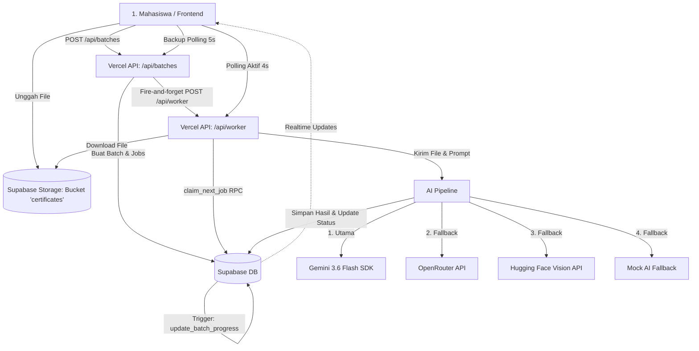

# Analisis Arsitektur & Cara Kerja Antrean Worker Batch dan AI Analysis

Dokumen ini menjelaskan secara menyeluruh tentang arsitektur sistem, alur eksekusi, serta hubungan antara **Frontend (React/Next.js)**, **Backend (Vercel Serverless/Next.js Route)**, **Supabase (Database, Storage, Triggers, & RPC)**, dan **AI Providers (Gemini, OpenRouter, Hugging Face)** pada proyek `certificate-review`.

---

## 1. Gambaran Umum Arsitektur (Architecture Overview)

Sistem ini didesain menggunakan arsitektur **Event-Driven Queue** berbasis database (PostgreSQL) yang berjalan di atas platform Serverless (Vercel) dengan integrasi Realtime Supabase. Arsitektur ini dipilih untuk menangani kendala *cold start* serverless, batasan durasi eksekusi (*timeout*), limitasi akun gratis Vercel (*Vercel Hobby cron limits*), serta menjaga keamanan dan performa aplikasi saat mahasiswa mengunggah banyak sertifikat sekaligus.

### Diagram Alur Sistem (System Flow Diagram)



---

## 2. Database Schema & Logic di Supabase (Postgres Tier)

Supabase bertindak sebagai database utama sekaligus pengelola status antrean melalui database trigger dan fungsi bawaan (RPC). 

### A. Tabel Utama Antrean (`supabase/migrations/20260817220000_add_async_queue.sql`)

Antrean dikelola oleh dua tabel utama: `review_batches` (induk antrean) dan `review_jobs` (pekerjaan per sertifikat).

*   **`public.review_batches`**: Menyimpan statistik agregat proses dari satu kali pengunggahan batch sertifikat oleh mahasiswa.
    ```sql
    create table public.review_batches (
      id uuid primary key default gen_random_uuid(),
      student_id uuid references public.profiles(id) on delete cascade not null,
      total_certificates integer not null default 0,
      completed_count integer not null default 0,
      processing_count integer not null default 0,
      queued_count integer not null default 0,
      failed_count integer not null default 0,
      status text not null check (status in ('queued', 'processing', 'completed', 'partial', 'failed')) default 'queued',
      avg_processing_ms integer,
      created_at timestamp with time zone default timezone('utc'::text, now()) not null,
      updated_at timestamp with time zone default timezone('utc'::text, now()) not null,
      completed_at timestamp with time zone
    );
    ```

*   **`public.review_jobs`**: Menyimpan pekerjaan individual untuk setiap sertifikat yang harus dianalisis oleh AI.
    ```sql
    create table public.review_jobs (
      id uuid primary key default gen_random_uuid(),
      batch_id uuid references public.review_batches(id) on delete cascade not null,
      certificate_id uuid references public.certificates(id) on delete cascade not null,
      status text not null check (status in ('queued', 'processing', 'completed', 'failed', 'cancelled')) default 'queued',
      priority integer not null default 0,
      attempts integer not null default 0,
      max_attempts integer not null default 3,
      started_at timestamp with time zone,
      completed_at timestamp with time zone,
      processing_time_ms integer,
      error_message text,
      created_at timestamp with time zone default timezone('utc'::text, now()) not null,
      updated_at timestamp with time zone default timezone('utc'::text, now()) not null
    );
    ```

### B. Klaim Job Atomik (`claim_next_job` RPC)

Ketika banyak worker berjalan secara paralel di Vercel, ada risiko dua worker mengambil pekerjaan yang sama. Untuk mencegahnya, digunakan fungsi PostgreSQL RPC `claim_next_job()` dengan mekanisme penguncian baris (`FOR UPDATE SKIP LOCKED`).

```sql
create or replace function public.claim_next_job()
returns public.review_jobs
language plpgsql
security definer
as $$
declare
  claimed_job public.review_jobs;
begin
  -- Mengupdate status pekerjaan antrean secara atomik
  update public.review_jobs
  set
    status = 'processing',
    started_at = now(),
    updated_at = now()
  where id = (
    select id
    from public.review_jobs
    where status = 'queued'
      and attempts < max_attempts
    order by priority desc, created_at asc
    limit 1
    for update skip locked -- Mengunci baris agar tidak diambil worker lain, lewati jika terkunci
  )
  returning * into claimed_job;

  return claimed_job;
end;
$$;
```

### C. Sinkronisasi Statistik Batch via DB Trigger (`update_batch_progress`)

Setiap kali status pekerjaan (`review_jobs`) berubah, PostgreSQL secara reaktif menghitung ulang statistik batch (`review_batches`) menggunakan trigger `on_review_job_change`. Hal ini menjamin konsistensi statistik di tingkat database tanpa perlu logika kalkulasi manual di sisi backend Next.js.

```sql
create or replace function public.update_batch_progress()
returns trigger
language plpgsql
security definer
as $$
declare
  batch_stats record;
  new_batch_status text;
begin
  -- Rekalkulasi semua jumlah berdasarkan baris job aktual
  select
    count(*) filter (where status = 'completed') as completed,
    count(*) filter (where status = 'processing') as processing,
    count(*) filter (where status = 'queued') as queued,
    count(*) filter (where status = 'failed') as failed,
    count(*) as total,
    case
      when count(*) filter (where status = 'completed' and processing_time_ms is not null) > 0
      then (sum(processing_time_ms) filter (where status = 'completed' and processing_time_ms is not null) /
            count(*) filter (where status = 'completed' and processing_time_ms is not null))::integer
      else null
    end as avg_ms
  into batch_stats
  from public.review_jobs
  where batch_id = coalesce(NEW.batch_id, OLD.batch_id);

  -- Menentukan status akhir batch
  if batch_stats.total = 0 then
    new_batch_status := 'queued';
  elsif batch_stats.completed = batch_stats.total then
    new_batch_status := 'completed';
  elsif batch_stats.failed = batch_stats.total then
    new_batch_status := 'failed';
  elsif batch_stats.failed > 0 and (batch_stats.completed + batch_stats.failed) = batch_stats.total then
    new_batch_status := 'partial'; -- Sebagian sukses, sebagian gagal
  elsif batch_stats.processing > 0 or batch_stats.completed > 0 then
    new_batch_status := 'processing';
  else
    new_batch_status := 'queued';
  end if;

  -- Update tabel review_batches
  update public.review_batches
  set
    completed_count = batch_stats.completed,
    processing_count = batch_stats.processing,
    queued_count = batch_stats.queued,
    failed_count = batch_stats.failed,
    status = new_batch_status,
    avg_processing_ms = batch_stats.avg_ms,
    updated_at = now(),
    completed_at = case
      when new_batch_status in ('completed', 'partial', 'failed') then now()
      else null
    end
  where id = coalesce(NEW.batch_id, OLD.batch_id);

  return NEW;
end;
$$;

create trigger on_review_job_change
  after insert or update of status on public.review_jobs
  for each row execute function public.update_batch_progress();
```

### D. Validasi Constraint Status Sertifikat (`supabase/migrations/20260818230000_allow_certificate_failed_status.sql`)

Terdapat perbaikan *bug* penting di mana sertifikat sebelumnya tidak mendukung status `'failed'`. Ketika analisis AI gagal permanen atau terjadi *timeout*, sertifikat akan tertahan pada status `'processing'`. Masalah ini diselesaikan dengan memperbarui constraint status tabel `certificates`:

```sql
alter table public.certificates
  drop constraint if exists certificates_status_check;

alter table public.certificates
  add constraint certificates_status_check
  check (status in ('pending', 'processing', 'ai_completed', 'waiting_review', 'approved', 'rejected', 'failed'))
  not valid;

alter table public.certificates
  validate constraint certificates_status_check;
```

---

## 3. Queue Processor & Worker Logic (Application Tier)

Logika pemrosesan antrean diatur di dalam file [src/lib/queue/processor.ts](file:///home/wildan/Downloads/certificate-review/src/lib/queue/processor.ts). File ini menangani siklus hidup pekerjaan, manajemen konkurensi, retrying, dan perlindungan *timeout* (Watchdog).

### A. Manajemen Konkurensi (`runWorker`)

Konkurensi dibatasi agar backend serverless tidak kewalahan (menghindari *rate limit* API AI).

```typescript
export const MAX_CONCURRENCY = parseInt(
  process.env.QUEUE_MAX_CONCURRENCY ?? '3',
  10
);

export async function runWorker(): Promise<WorkerRunResult> {
  const result: WorkerRunResult = { claimed: 0, processed: 0, errors: [], skipped: false, cleanedUp: 0 };

  // 1. Jalankan watchdog terlebih dahulu untuk membersihkan job macet
  try {
    result.cleanedUp = await cleanupStuckJobs();
  } catch (err) {
    console.error('[Worker] Watchdog cleanup error:', err);
  }

  // 2. Cek slot konkurensi yang tersedia
  const processing = await countProcessingJobs();
  const available = MAX_CONCURRENCY - processing;

  if (available <= 0) {
    result.skipped = true;
    result.reason = `Concurrency limit reached (${processing}/${MAX_CONCURRENCY} active)`;
    return result;
  }

  const promises: Promise<void>[] = [];

  // 3. Ambil job sesuai slot yang tersedia dan jalankan secara paralel
  for (let i = 0; i < available; i++) {
    const job = await claimNextJob();
    if (!job) break; // Tidak ada lagi job di antrean

    result.claimed++;
    promises.push(
      processJob(job)
        .then(() => { result.processed++; })
        .catch(err => {
          result.errors.push(err instanceof Error ? err.message : String(err));
        })
    );
  }

  await Promise.allSettled(promises);
  return result;
}
```

### B. Pembersihan Job Macet (`cleanupStuckJobs` / Watchdog)

Serverless function dapat dihentikan paksa oleh penyedia cloud (seperti Vercel jika melewati batas durasi). Hal ini dapat menyebabkan job tertahan pada status `'processing'` selamanya. Fungsi *watchdog* akan mendeteksi pekerjaan yang berjalan lebih dari 10 menit (`JOB_TIMEOUT_MS`) dan menandainya sebagai `'failed'`.

```typescript
export const JOB_TIMEOUT_MS = 10 * 60 * 1000; // 10 menit

export async function cleanupStuckJobs(): Promise<number> {
  const supabase = createAdminClient();
  const timeoutThreshold = new Date(Date.now() - JOB_TIMEOUT_MS).toISOString();

  // Mencari job yang berstatus 'processing' lebih dari 10 menit
  const { data: stuckJobs } = await supabase
    .from('review_jobs')
    .select('id, certificate_id, started_at')
    .eq('status', 'processing')
    .lt('started_at', timeoutThreshold);

  if (!stuckJobs || stuckJobs.length === 0) return 0;

  console.log(`[Watchdog] Found ${stuckJobs.length} stuck jobs (> 10 min), marking as failed`);

  for (const job of stuckJobs) {
    -- Tandai job sebagai gagal
    await supabase
      .from('review_jobs')
      .update({
        status: 'failed',
        error_message: 'Job timeout: exceeded 10 minute processing limit',
        processing_time_ms: JOB_TIMEOUT_MS,
        updated_at: new Date().toISOString(),
      })
      .eq('id', job.id);

    -- Tandai pula sertifikat terkait sebagai gagal
    await supabase
      .from('certificates')
      .update({ status: 'failed', updated_at: new Date().toISOString() })
      .eq('id', job.certificate_id);
  }

  return stuckJobs.length;
}
```

### C. Mekanisme Retry Otomatis (`processJob` & `isRetryableError`)

Jika terjadi error saat menghubungi API AI (misalnya limitasi kuota atau gangguan jaringan), sistem akan mencoba kembali pekerjaan tersebut (maksimal 3 kali percobaan) selama error tersebut diklasifikasikan sebagai *retryable*.

```typescript
function isRetryableError(message: string): boolean {
  const retryablePatterns = [
    'rate limit', 'quota', '429', 'timeout', 'network',
    'ECONNRESET', 'ETIMEDOUT', 'fetch failed', 'service unavailable',
    '503', '500'
  ];
  const lower = message.toLowerCase();
  return retryablePatterns.some(p => lower.includes(p));
}

// Bagian dari penanganan error di processJob(job):
} catch (error) {
  const processingMs = Date.now() - startTime;
  const message = error instanceof Error ? error.message : 'Unknown error';
  const isRetryable = isRetryableError(message);
  const newAttempts = job.attempts + 1;
  const shouldRetry = isRetryable && newAttempts < job.max_attempts;

  if (shouldRetry) {
    // Masukkan kembali ke antrean untuk dicoba lagi
    await supabase
      .from('review_jobs')
      .update({
        status: 'queued',
        attempts: newAttempts,
        error_message: `Attempt ${newAttempts}: ${message}`,
        processing_time_ms: processingMs,
        updated_at: new Date().toISOString(),
      })
      .eq('id', job.id);

    // Kembalikan status sertifikat ke pending
    await supabase
      .from('certificates')
      .update({ status: 'pending', updated_at: new Date().toISOString() })
      .eq('id', job.certificate_id);
  } else {
    // Tandai sebagai gagal permanen
    await supabase
      .from('review_jobs')
      .update({
        status: 'failed',
        attempts: newAttempts,
        error_message: message,
        processing_time_ms: processingMs,
        updated_at: new Date().toISOString(),
      })
      .eq('id', job.id);

    await supabase
      .from('certificates')
      .update({ status: 'failed', updated_at: new Date().toISOString() })
      .eq('id', job.certificate_id);
  }
}
```

---

## 4. AI Processing Pipeline & Fallback Chain (AI Tier)

Proses ekstraksi data sertifikat menggunakan teknik **Single-Pass Analysis** di [src/lib/ai/pipeline.ts](file:///home/wildan/Downloads/certificate-review/src/lib/ai/pipeline.ts). Metode ini menggabungkan ekstraksi teks (OCR) dan analisis bobot akademik berdasarkan aturan UINSU ke dalam satu panggilan API model AI. Langkah ini menghemat waktu dari sebelumnya sekitar 9 detik menjadi hanya sekitar 3 detik.

### Strategi Toleransi Kesalahan Berlapis (Tiered Fallback Strategy)

Jika terjadi kegagalan sistem pada salah satu penyedia AI, sistem secara otomatis beralih ke penyedia cadangan berikutnya dengan batas *timeout* yang terkontrol menggunakan helper `withTimeout`.

```typescript
// Rantai Eksekusi Pipeline:
// 1. Google Gemini 3.6 Flash SDK (Timeout 90s)
// 2. OpenRouter - google/gemini-2.5-flash (Timeout 90s)
// 3. Hugging Face - Qwen-VL (Timeout 80s)
// 4. Mock AI Fallback (Sebagai pengaman terakhir)
```

Berikut adalah cuplikan alur penanganan fallback di `runPipeline`:

```typescript
// 1. Coba menggunakan Gemini SDK resmi
try {
  const response = await withTimeout(
    ai.models.generateContent({
      model: 'gemini-3.6-flash',
      contents: [{ role: 'user', parts: [{ inlineData: { data: base64Data, mimeType } }, { text: prompt }] }],
      config: {
        responseMimeType: 'application/json',
        responseSchema: { /* schema Zod terjemahan */ }
      }
    }),
    geminiTimeout,
    'Gemini API timeout after 90s'
  );
  responseText = response?.text ?? null;
} catch (apiError) {
  // Cek apakah error tersebut aman untuk dicoba dengan fallback (misal: kuota habis/429)
  if (!isGeminiRetryable) throw apiError;
}

// 2. Fallback ke OpenRouter jika Gemini gagal
if (!responseText) {
  try {
    const response = await withTimeout(
      fetch('https://openrouter.ai/api/v1/chat/completions', {
        method: 'POST',
        headers: { Authorization: `Bearer ${openRouterKey}`, ... },
        body: JSON.stringify({ model: openRouterModel, messages: [...] })
      }),
      openRouterTimeout,
      'OpenRouter API timeout after 90s'
    );
    const data = await response.json();
    responseText = data?.choices?.[0]?.message?.content ?? null;
    modelName = `openrouter:${openRouterModel}`;
  } catch (orError) { ... }
}

// 3. Fallback ke Hugging Face Vision API jika OpenRouter gagal
if (!responseText) {
  try {
    const hfResponse = await withTimeout(
      callHuggingFaceVision({ dataUrl, prompt }),
      hfTimeout,
      'Hugging Face API timeout after 80s'
    );
    responseText = hfResponse;
    modelName = `hf:${hfModel}`;
  } catch (hfError) { ... }
}

// 4. Pengaman Terakhir: Mock AI berbasis nama file jika semua API gagal
if (!responseText) {
  return mockPipeline(cert.file_name);
}

// Akhir: Normalisasi & Validasi output JSON dengan Zod schema
const parsed = combinedSchema.parse(normalizeQwenResult(responseText));
```

---

## 5. API Routes di Vercel (Routing & Trigger Tier)

Ada dua endpoint utama Next.js API Routes yang berjalan di Vercel Serverless:

### A. Endpoint Batch Creation (`src/app/api/batches/route.ts`)

Menangani penerimaan berkas sertifikat yang telah diunggah di frontend, menyimpannya ke database, lalu menembak worker antrean secara *asynchronous* (fire-and-forget).

```typescript
export async function POST(request: NextRequest) {
  const supabaseAdmin = createAdminClient();
  try {
    // 1. Autentikasi Pengguna
    const supabaseServer = await createServerClient();
    const { data: { user } } = await supabaseServer.auth.getUser();
    if (!user) return NextResponse.json({ error: 'Unauthorized' }, { status: 401 });

    const body = await request.json();
    const { certificates } = body;

    // 2. Batasan maks 20 sertifikat per batch
    if (certificates.length > 20) return NextResponse.json({ error: 'Max 20' }, { status: 400 });

    // 3. Menyimpan review_batches
    const { data: batch } = await supabaseAdmin.from('review_batches').insert({
      student_id: user.id,
      total_certificates: certificates.length,
      status: 'queued',
    }).select().single();

    // 4. Menyimpan data certificates dengan status 'pending'
    const certInserts = certificates.map(c => ({ ..., status: 'pending', batch_id: batch.id }));
    await supabaseAdmin.from('certificates').insert(certInserts);

    // 5. Menyimpan jobs di review_jobs dengan status 'queued'
    const jobInserts = certificates.map(c => ({ batch_id: batch.id, certificate_id: c.id, status: 'queued' }));
    await supabaseAdmin.from('review_jobs').insert(jobInserts);

    // 6. Memicu Worker secara Asinkron (fire-and-forget) agar proses unggah responsif
    console.log('[Batches] Dispatching worker in background...');
    const workerUrl = `${process.env.NEXT_PUBLIC_APP_URL || 'http://localhost:3000'}/api/worker`;
    void fetch(workerUrl, {
      method: 'POST',
      headers: { 'x-cron-secret': process.env.CRON_SECRET || '' }
    }).catch(err => console.warn(err));

    return NextResponse.json({ success: true, batchId: batch.id });
  } catch (error) { ... }
}
```

### B. Endpoint Worker (`src/app/api/worker/route.ts`)

Endpoint ini dipanggil secara berkala untuk memproses pekerjaan dalam antrean. Karena API ini berjalan sebagai serverless function di Vercel, ditambahkan opsi konfigurasi khusus untuk memperpanjang waktu eksekusi agar pemrosesan gambar dan dokumen AI tidak terputus di tengah jalan.

```typescript
import { NextRequest, NextResponse } from 'next/server';
import { runWorker } from '@/lib/queue/processor';

// Mengatur durasi maksimal eksekusi Vercel Serverless menjadi 5 Menit (300 detik)
// Fitur ini hanya berlaku di Vercel Pro/Enterprise, namun sangat penting untuk mencegah pemotongan eksekusi AI.
export const maxDuration = 300; 

function isAuthorized(request: NextRequest): boolean {
  const expectedSecret = process.env.CRON_SECRET;
  if (!expectedSecret) return true; // Mode development (tanpa pengamanan)

  // Otorisasi otomatis dari Vercel Cron
  const authHeader = request.headers.get('authorization');
  if (authHeader === `Bearer ${expectedSecret}`) return true;

  // Otorisasi manual dari client browser
  const secretHeader = request.headers.get('x-cron-secret');
  if (secretHeader === expectedSecret) return true;

  return false;
}

// Dipanggil oleh Vercel Cron (setiap hari pukul 02:00 pagi berdasarkan vercel.json)
export async function GET(request: NextRequest) {
  if (!isAuthorized(request)) return NextResponse.json({ error: 'Unauthorized' }, { status: 401 });
  
  const result = await runWorker();
  return NextResponse.json({ success: true, ...result });
}

// Dipanggil secara instan setelah pembuatan batch
export async function POST(request: NextRequest) {
  if (!isAuthorized(request)) return NextResponse.json({ error: 'Unauthorized' }, { status: 401 });
  
  const result = await runWorker();
  return NextResponse.json({ success: true, ...result });
}
```

---

## 6. Frontend & Hybrid Polling (`BatchProgress.tsx`)

File [src/components/dashboard/BatchProgress.tsx](file:///home/wildan/Downloads/certificate-review/src/components/dashboard/BatchProgress.tsx) menampilkan progres pemrosesan batch kepada mahasiswa secara dinamis. Komponen ini menerapkan strategi **Hybrid Polling & WebSockets** untuk mengatasi batasan platform Vercel Hobby.

### Batasan Vercel Hobby & Solusi Hybrid Polling
Pada paket **Vercel Hobby (Gratis)**, cron job hanya diizinkan berjalan maksimal sekali sehari (`0 2 * * *` di `vercel.json`). Jika mahasiswa mengunggah berkas di luar jadwal tersebut, antrean tidak akan berjalan secara otomatis.

Untuk mengatasinya, ketika komponen `BatchProgress` aktif dan memantau antrean yang masih berjalan (`queued` atau `processing`), frontend React bertindak sebagai pemicu (*trigger*):
1.  **Supabase Realtime (Websocket)**: Melakukan *listening* perubahan baris tabel `review_jobs` dan `review_batches` secara instan.
2.  **Worker Trigger Polling (Setiap 4 Detik)**: Secara aktif memanggil `/api/worker` dari sisi peramban (*browser*). Ini memaksa Vercel serverless function bangkit dan memproses antrean sertifikat.
3.  **Status Backup Polling (Setiap 5 Detik)**: Memperbarui data batch lewat HTTP request biasa sebagai cadangan jika koneksi WebSocket lambat atau terputus.

```typescript
useEffect(() => {
  const isDone =
    batch?.status === 'completed' ||
    batch?.status === 'partial' ||
    batch?.status === 'failed';

  if (isDone || !batch) return; // Hentikan polling jika batch sudah selesai

  const triggerWorker = () => {
    fetch('/api/worker', {
      method: 'GET',
      headers: {
        'x-cron-secret': process.env.NEXT_PUBLIC_CRON_SECRET || '',
      },
    }).catch(() => {/* abaikan jika gagal, worker opsional */});
  };

  // Pemicuan pertama saat komponen terpasang
  triggerWorker();

  // Polling aktif ke worker setiap 4 detik untuk mempercepat pemrosesan antrean
  const workerInterval = setInterval(triggerWorker, 4000);

  // Backup polling status batch setiap 5 detik
  const pollInterval = setInterval(fetchBatchStatus, 5000);

  return () => {
    clearInterval(workerInterval);
    clearInterval(pollInterval);
  };
}, [batch?.status, batchId]);
```

---

## 7. Alur Lengkap Siklus Hidup Eksekusi (Step-by-Step Lifecycle)

Sebagai ringkasan, berikut adalah alur kronologis sejak berkas sertifikat diunggah hingga statusnya diperbarui:

1.  **Langkah 1: Unggah & Pra-Registrasi**
    *   Sertifikat disimpan di Supabase Storage (`certificates` bucket).
    *   Client memanggil `POST /api/batches`.
    *   Database mendaftarkan batch (`review_batches`), sertifikat (`certificates`, status: `'pending'`), dan pekerjaan (`review_jobs`, status: `'queued'`).
    *   Client menerima respons ID Batch secara instan, layar memunculkan komponen `BatchProgress`.

2.  **Langkah 2: Pemicuan Worker**
    *   Browser memanggil endpoint `/api/worker` melalui interval polling 4 detik.
    *   Serverless function di Vercel aktif dan memanggil `runWorker()`.

3.  **Langkah 3: Pembersihan & Klaim Pekerjaan**
    *   *Watchdog* memeriksa apakah ada pekerjaan yang macet lebih dari 10 menit dan membatalkannya.
    *   Fungsi DB RPC `claim_next_job()` dipanggil.
    *   Database mengunci baris dengan status `'queued'` teratas (menggunakan `SKIP LOCKED`) dan mengubah statusnya menjadi `'processing'`.

4.  **Langkah 4: Pemrosesan AI**
    *   Sertifikat diunduh dari Supabase Storage dan diubah menjadi format base64.
    *   `runPipeline()` memicu analisis model AI dengan rantai fallback:
        `Gemini SDK` $\rightarrow$ `OpenRouter` $\rightarrow$ `Hugging Face` $\rightarrow$ `Mock Fallback`.
    *   AI mengekstrak teks serta menganalisis bobot sertifikat berdasarkan data aturan yang dibaca dari tabel `weight_rules`.

5.  **Langkah 5: Penyimpanan Hasil & Pembaruan Status**
    *   Hasil ekstraksi disimpan di tabel `certificate_ai_analysis`.
    *   Tabel `certificates` diperbarui (mengisi judul, kategori, durasi, dll) dan statusnya diubah menjadi `'waiting_review'`.
    *   Tabel `review_jobs` diperbarui dengan status `'completed'`.
    *   *(Jika AI gagal & dapat dicoba kembali, status pekerjaan kembali ke `'queued'` dan status sertifikat kembali ke `'pending'`)*.

6.  **Langkah 6: Pembaruan Statistik Batch & UI**
    *   Trigger database `on_review_job_change` otomatis memperbarui statistik di tabel `review_batches` (misalnya menghitung `completed_count` dan mengubah status batch ke `'completed'`).
    *   Supabase memancarkan perubahan database lewat WebSocket Realtime.
    *   Komponen `BatchProgress` di frontend menerima data terbaru, mengubah bar progres menjadi hijau (100%), dan menampilkan detail hasil sertifikat kepada mahasiswa. Proses antrean selesai.
